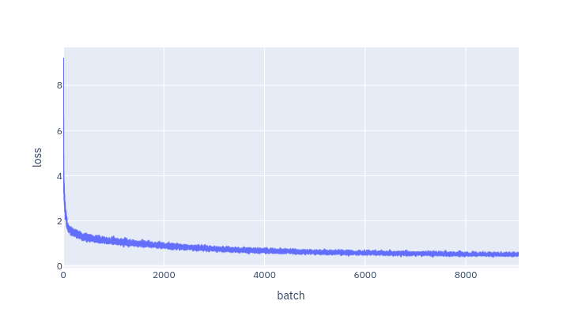

### Постановка задачі

Натренувати нейрону мережу для перекладу з німецької мови на англійську.

### Набір даних

Використано паралельні (німецько-англійські) транскрипції засідань Європейського парламенту (https://www.statmt.org/europarl/).

### Підготовка даних

У сирому вигляді транскрипції мають вигляд текстових файлів,
де N-й рядок одного файлу відповідає N-му рядку іншого.
Для подальшої роботи файли перейменовані на `de` та `en`.
Для токенізації тексту використовується система SentencePiece (https://github.com/google/sentencepiece).
Скрипт [`prepare_data.py`](./prepare_data.py) тренує по токенайзеру для обох мов,
та зберігає результуючі словники та моделі як `de.vocab`, `de.model`, `en.vocab`, `en.model`
відповідно.

### Архітектура моделі

Використовується архітектура Трансформер (формат енкодер-декодер),
реалізована в файлі [`transformer.py`](./transformer.py).

### Тренування

Тренування виконується скриптом [`train.py`](./train.py).
Він містить значення гіперпараметрів за замовчуванням,
а також дає можливість їх змінювати через командний рядок,
наприклад `python train.py --lr 0.00005 --dropout 0.2 --n-heads 4`.
За замовчуванням модель має 59510544 параметрів:

```
Transformer(
  (in_embed): Embedding(10000, 512)
  (out_embed): Embedding(10000, 512)
  (pos_embed): PosEmbed()
  (encoder): Encoder(
    (layers): ModuleList(
      (0-5): 6 x EncoderLayer(
        (norms): ModuleList(
          (0-1): 2 x LayerNorm((512,), eps=1e-05, elementwise_affine=True)
        )
        (drops): ModuleList(
          (0-1): 2 x Dropout(p=0.1, inplace=False)
        )
        (attn): MultiheadAttention(
          (w_q): Linear(in_features=512, out_features=512, bias=True)
          (w_k): Linear(in_features=512, out_features=512, bias=True)
          (w_v): Linear(in_features=512, out_features=512, bias=True)
          (w_0): Linear(in_features=512, out_features=512, bias=True)
          (drop): Dropout(p=0.1, inplace=False)
          (softmax): Softmax(dim=-1)
        )
        (ff): FFLayer(
          (0): Linear(in_features=512, out_features=2048, bias=True)
          (1): ReLU()
          (2): Dropout(p=0.1, inplace=False)
          (3): Linear(in_features=2048, out_features=512, bias=True)
        )
      )
    )
    (norm): LayerNorm((512,), eps=1e-05, elementwise_affine=True)
  )
  (decoder): Decoder(
    (layers): ModuleList(
      (0-5): 6 x DecoderLayer(
        (norms): ModuleList(
          (0-2): 3 x LayerNorm((512,), eps=1e-05, elementwise_affine=True)
        )
        (drops): ModuleList(
          (0-2): 3 x Dropout(p=0.1, inplace=False)
        )
        (attns): ModuleList(
          (0-1): 2 x MultiheadAttention(
            (w_q): Linear(in_features=512, out_features=512, bias=True)
            (w_k): Linear(in_features=512, out_features=512, bias=True)
            (w_v): Linear(in_features=512, out_features=512, bias=True)
            (w_0): Linear(in_features=512, out_features=512, bias=True)
            (drop): Dropout(p=0.1, inplace=False)
            (softmax): Softmax(dim=-1)
          )
        )
        (ff): FFLayer(
          (0): Linear(in_features=512, out_features=2048, bias=True)
          (1): ReLU()
          (2): Dropout(p=0.1, inplace=False)
          (3): Linear(in_features=2048, out_features=512, bias=True)
        )
      )
    )
    (norm): LayerNorm((512,), eps=1e-05, elementwise_affine=True)
  )
  (last): Sequential(
    (0): Linear(in_features=512, out_features=10000, bias=True)
    (1): LogSoftmax(dim=-1)
  )
)
```

Тренування відбувалось протягом кількох годин на GPU Nvidia L4 та тривало 9000 ітерацій
із розміром батчу 128.
Кожні 500 ітерацій зберігались ваги моделі.
Валідаційна вибірка не виділялась,
оскільки за такого обсягу даних кількість ітерацій тренування не досягало навіть однієї епохи.
Графік функції втрат:



### Попередні результати

Переклад на власних текстах здійснюється скриптом [`inf.py`](./inf.py),
що приймає як аргументи шлях до збереженої моделі та текст німецькою.
Найкращою версією моделі видається версія, збережена після 8000 ітерацій.

Модель здатна встановити правильний порядок слів під час перекладу
(`sind` наприкінці речення німецькою відповідає `are` усередині речення англійською):

```
$ python inf.py checkpoint_8000.pt "Sie denken, dass diese Dinge nicht sehr wichtig sind"
You think that these things are not very important
```

Модель правильно додає допоміжні дієслова в питаннях англійською,
які не використовуються в німецькій мові
(`Denken Sie`, дослівно `Think you`, відповідає `Do you think`):

```
$ python inf.py checkpoint_8000.pt "Denken Sie, dass diese Dinge sehr wichtig sind"
Do you think that these things are very important
```

Модель вивчила обидва варіанти формування заперечення наявності іменника в німецькій мові
(`keine` та `nicht eine`):

```
$ python inf.py checkpoint_8000.pt "Das war nicht eine Frau"
That was not a woman
$ python inf.py checkpoint_8000.pt "Das war keine Frau"
That was not a woman
```

Модель вивчила звороти на кшталт "не лише …, а й …":

```
$ python inf.py checkpoint_8000.pt "Die Ursache ist nicht nur mich, sondern auch das Wetter"
The cause is not only me but also the weather
```

Модель здатна розпізнати інверсію підмета та додатка,
дозволену в німецькій мові
(дослівним перекладом є `That want I to do`):

```
$ python inf.py checkpoint_8000.pt "Das will ich tun"
I want to do that
```

Модель здатна ідіоматично перефразовувати
(дослівним перекладом є `I have not done it with pleasure`):

```
$ python inf.py checkpoint_8000.pt "Ich habe es nicht gerne getan"
I have not been happy to do so
```

Через формальну природу текстів у використаному наборі даних,
модель може галюцинувати на повсякденних репліках:

```
$ # I love you
$ python inf.py checkpoint_8000.pt "Ich liebe dich"
I am particularly concerned
```

```
$ # I don't like green flowers
$ python inf.py checkpoint_8000.pt "Grüne Blumen gefallen mir nicht"
The Greens, in the Greens, did not have me
```

```
$ # Stop
$ python inf.py checkpoint_8000.pt "Hör auf"
Heörms on von
```

Також модель іноді зациклюється в непоганих в усьому іншому перекладах:

```
$ python inf.py checkpoint_8000.pt "Das Buch ist auf dem Tisch"
The book is on the table on the table
$ python inf.py checkpoint_8000.pt "Das Buch ist nicht auf dem Tisch"
The book is not on the table
```

```
$ python inf.py checkpoint_8000.pt "Die Ursache ist nicht nur mich, sondern auch Sie"
The cause is not only me but also you, but you also, you, too, you, but also you, you, too, are not just my but also you, you, but also you, you, you, you, too, but also you, you, too, you, too, you, too, you, too, but also you, you, you, too, you, too, you, too, and you, also, you, too, you, you, you, too, not just as well, but also, you, you, you, you, you, you, you
```

```
$ python inf.py checkpoint_8000.pt "Zwei Euro ist nicht genug"
Two euro is not enough to be enough to have two euro
```

```
$ python inf.py checkpoint_8000.pt "Man kann Glück nicht kaufen"
You cannot buy luck, luck, lucky lucky luck
```

```
$ python inf.py checkpoint_8000.pt "Kriegen ändern sich nie"
Wars never change to wars never changed
```

```
$ python inf.py checkpoint_8000.pt "Je schneller, desto günstiger"
The more faster, the more favourable, the more favourable more favourable, the more favourable more favourable
```

### Можливі покращення

Модель не є робастною до деяких простих орфографічних помилок (`u`/`ü`, `ß`/`ss`):

```
$ python inf.py checkpoint_8000.pt "Der Flugzeug ist alt"
The aircraft is old
$ python inf.py checkpoint_8000.pt "Der Flügzeug ist alt"
The Frogation is old
```

```
$ python inf.py checkpoint_8000.pt "Die Autos sind groß"
The cars are large
$ python inf.py checkpoint_8000.pt "Die Autos sind gross"
The cars are the motorssss of Europe
```

```
$ python inf.py checkpoint_8000.pt "Zum Geburtstag viel Glück!"
For birthday, a lot of luck
$ python inf.py checkpoint_8000.pt "Zum Gebürtstag viel Gluck!"
For the sake of the day, a lot of plucket
```

Можливим способом усунути цей недолік є аугментація тренувальних даних,
що полягає у випадковому внесені помилок у текст для перекладу.

Також модель схильна зациклюватись на коротких,
неповних реченнях:

```
$ python inf.py checkpoint_8000.pt "Nein"
Nono No Nono No Nono Nono No Nono No No
```

```
$ python inf.py checkpoint_8000.pt "Das Radio"
The radio radio radio radio radio radio radio radio radio radio radio radio radio radio radio radio radio radio
```

Це можна спробувати усунути додавши штучні штрафи за перевикористання токенів
або ж урізноманітнивши зазвичай довгі речення у тренувальному наборі даних короткими.

### Реалізація штрафу за перевикористання токенів

У скрипт [`inf.py`](./inf.py) додано реалізацію штрафу за перевикористання токенів.
Зі значенням штрафу `3` модель уникає більше зациклювань
та при цьому не втрачає в якості перекладу.

```
$ python inf.py checkpoint_8000.pt "Die Ursache ist nicht nur mich, sondern auch Sie" --frequency-penalty 3
The cause is not only me but also you, too
```

```
$ python inf.py checkpoint_8000.pt "Das Buch ist auf dem Tisch" --frequency-penalty 3
The book is on the table
$ python inf.py checkpoint_8000.pt "Das Buch ist auf dem Tisch auf dem Tisch" --frequency-penalty 3
The book is on the table at the table
```

```
$ python inf.py checkpoint_8000.pt "Man kann Glück nicht kaufen" --frequency-penalty 3
You cannot buy luck, good luck
```
